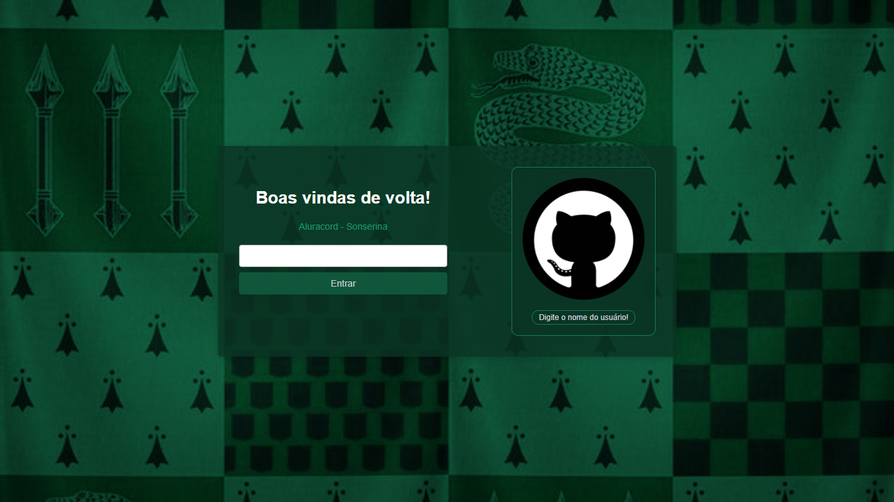
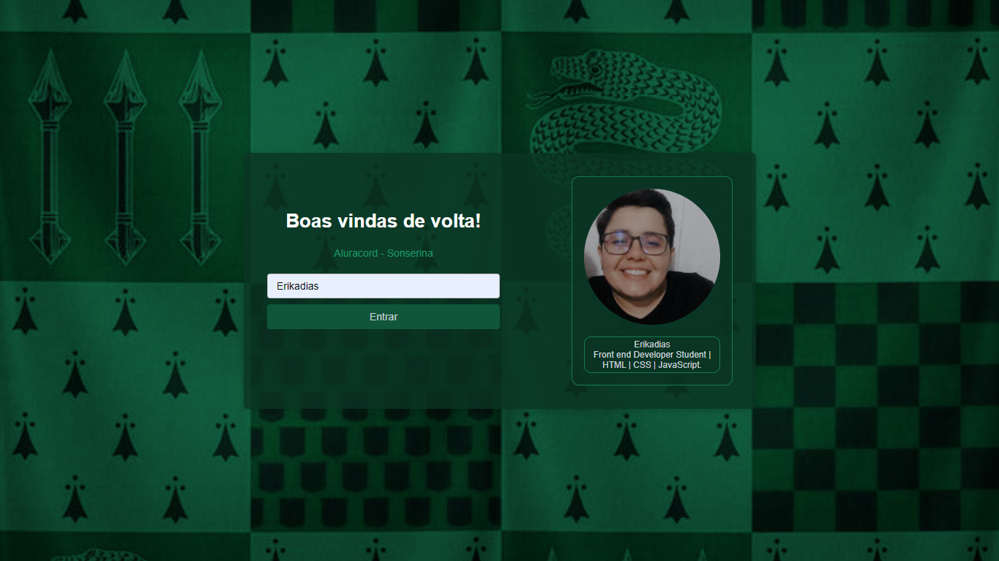
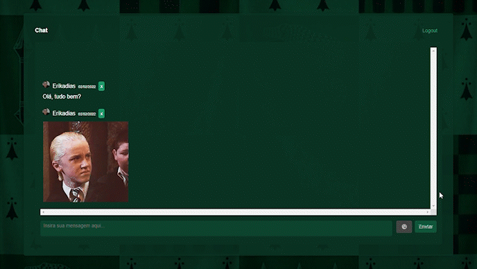

# Aluracord - Sonserina

Projeto criado na Imersão React onde criamos um clone do discord personalizado.

#### Página de Login

  

  

#### Página do Chat

  

# Desafios:

-   [x] Só mostrar a imagem se tiver mais de 2 caracteres.
-   [x] Pegar outras informações do usuário batendo na API do GitHub.
-   [x] Colocar o botão de OK para enviar a mensagem.
-   [x] Colocar um botão de apagar mensagem.
-   [ ] Fazer um efeito quando passar o mouse em cima.

 

# Tecnologias

-   Next
-   React
-   Npm (v14.15.4)
-   Supabase
-   SkynexUi

 

Link do projeto: <strong><a href="https://imersao-react-sonserina.vercel.app">Aluracord - Sonserina</a></strong>
